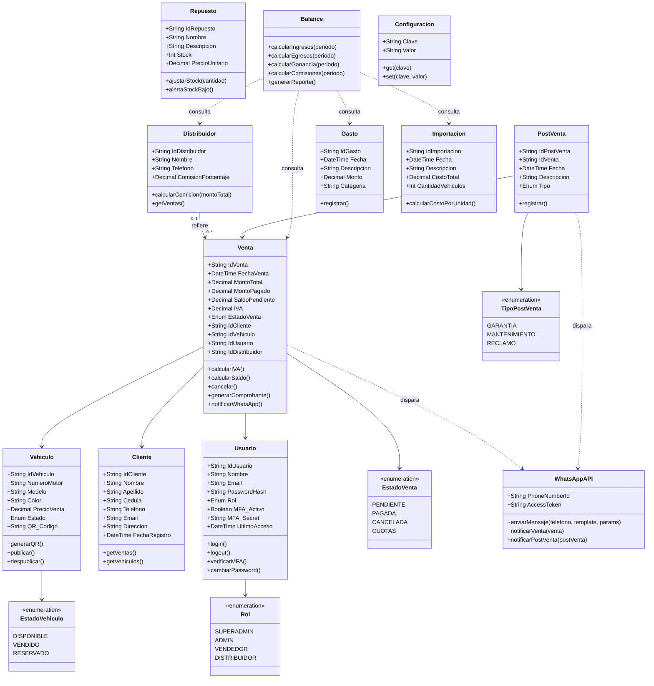

# Diagrama de Clases — LTeco ERP System V3

```mermaid
classDiagram

%% ─── USUARIOS Y ROLES ───────────────────────────────────────
class Usuario {
  +String IdUsuario
  +String Nombre
  +String Email
  +String PasswordHash
  +Enum Rol
  +Boolean MFA_Activo
  +String MFA_Secret
  +DateTime UltimoAcceso
  +login()
  +logout()
  +verificarMFA()
  +cambiarPassword()
}

class Rol {
  <<enumeration>>
  SUPERADMIN
  ADMIN
  VENDEDOR
  DISTRIBUIDOR
}

Usuario --> Rol

%% ─── CLIENTES ───────────────────────────────────────────────
class Cliente {
  +String IdCliente
  +String Nombre
  +String Apellido
  +String Cedula
  +String Telefono
  +String Email
  +String Direccion
  +DateTime FechaRegistro
  +getVentas()
  +getVehiculos()
}

%% ─── VEHÍCULOS ───────────────────────────────────────────────
class Vehiculo {
  +String IdVehiculo
  +String NumeroMotor
  +String Modelo
  +String Color
  +Decimal PrecioVenta
  +Enum Estado
  +String QR_Codigo
  +generarQR()
  +publicar()
  +despublicar()
}

class EstadoVehiculo {
  <<enumeration>>
  DISPONIBLE
  VENDIDO
  RESERVADO
}

Vehiculo --> EstadoVehiculo

%% ─── VENTAS ─────────────────────────────────────────────────
class Venta {
  +String IdVenta
  +DateTime FechaVenta
  +Decimal MontoTotal
  +Decimal MontoPagado
  +Decimal SaldoPendiente
  +Decimal IVA
  +Enum EstadoVenta
  +String IdCliente
  +String IdVehiculo
  +String IdUsuario
  +String IdDistribuidor
  +calcularIVA()
  +calcularSaldo()
  +cancelar()
  +generarComprobante()
  +notificarWhatsApp()
}

class EstadoVenta {
  <<enumeration>>
  PENDIENTE
  PAGADA
  CANCELADA
  CUOTAS
}

Venta --> EstadoVenta
Venta --> Cliente
Venta --> Vehiculo
Venta --> Usuario

%% ─── DISTRIBUIDORES ──────────────────────────────────────────
class Distribuidor {
  +String IdDistribuidor
  +String Nombre
  +String Telefono
  +Decimal ComisionPorcentaje
  +calcularComision(montoTotal)
  +getVentas()
}

%% Comisión = 6.67% sobre total con IVA
Distribuidor "0..1" --> "0..*" Venta : refiere

%% ─── REPUESTOS ───────────────────────────────────────────────
class Repuesto {
  +String IdRepuesto
  +String Nombre
  +String Descripcion
  +Int Stock
  +Decimal PrecioUnitario
  +ajustarStock(cantidad)
  +alertaStockBajo()
}

%% ─── POST-VENTA ──────────────────────────────────────────────
class PostVenta {
  +String IdPostVenta
  +String IdVenta
  +DateTime Fecha
  +String Descripcion
  +Enum Tipo
  +registrar()
}

class TipoPostVenta {
  <<enumeration>>
  GARANTIA
  MANTENIMIENTO
  RECLAMO
}

PostVenta --> TipoPostVenta
PostVenta --> Venta

%% ─── GASTOS ──────────────────────────────────────────────────
class Gasto {
  +String IdGasto
  +DateTime Fecha
  +String Descripcion
  +Decimal Monto
  +String Categoria
  +registrar()
}

%% ─── IMPORTACIONES ───────────────────────────────────────────
class Importacion {
  +String IdImportacion
  +DateTime Fecha
  +String Descripcion
  +Decimal CostoTotal
  +Int CantidadVehiculos
  +calcularCostoPorUnidad()
}

%% ─── BALANCE ─────────────────────────────────────────────────
class Balance {
  +calcularIngresos(periodo)
  +calcularEgresos(periodo)
  +calcularGanancia(periodo)
  +calcularComisiones(periodo)
  +generarReporte()
}

Balance ..> Venta : consulta
Balance ..> Gasto : consulta
Balance ..> Importacion : consulta
Balance ..> Distribuidor : consulta

%% ─── WHATSAPP ────────────────────────────────────────────────
class WhatsAppAPI {
  +String PhoneNumberId
  +String AccessToken
  +enviarMensaje(telefono, template, params)
  +notificarVenta(venta)
  +notificarPostVenta(postVenta)
}

Venta ..> WhatsAppAPI : dispara
PostVenta ..> WhatsAppAPI : dispara

%% ─── CONFIGURACIÓN ───────────────────────────────────────────
class Configuracion {
  +String Clave
  +String Valor
  +get(clave)
  +set(clave, valor)
}
```
