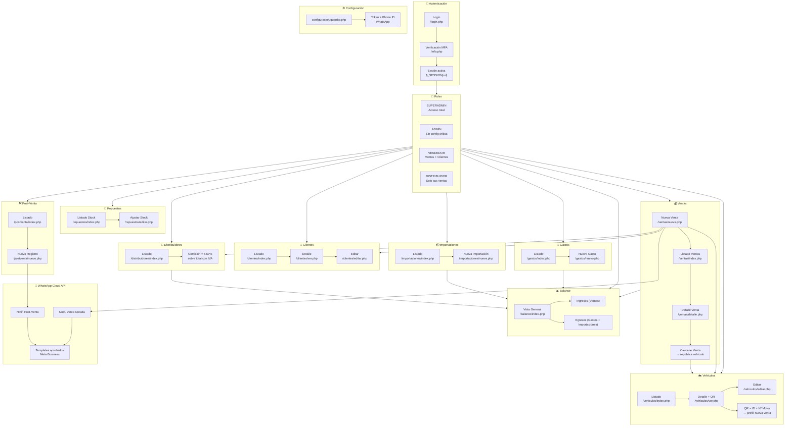

# Diagrama de Módulos — Panel Ltecobike V3

```mermaid
flowchart TD

%% ─── AUTENTICACIÓN ───────────────────────────────────────────
subgraph AUTH["🔐 Autenticación"]
  LOGIN["Login<br/>/login.php"]
  MFA["Verificación MFA<br/>/mfa.php"]
  SESSION["Sesión activa<br/>$_SESSION[rol]"]
  LOGIN --> MFA --> SESSION
end

%% ─── CONTROL DE ACCESO ───────────────────────────────────────
subgraph ROLES["👥 Roles"]
  R1["SUPERADMIN<br/>Acceso total"]
  R2["ADMIN<br/>Sin config crítica"]
  R3["VENDEDOR<br/>Ventas + Clientes"]
  R4["DISTRIBUIDOR<br/>Solo sus ventas"]
end

SESSION --> ROLES

%% ─── MÓDULOS PRINCIPALES ─────────────────────────────────────
subgraph VENTAS["💰 Ventas"]
  NV["Nueva Venta<br/>/ventas/nueva.php"]
  LV["Listado Ventas<br/>/ventas/index.php"]
  DV["Detalle Venta<br/>/ventas/detalle.php"]
  CV["Cancelar Venta<br/>→ republica vehículo"]
  NV --> LV
  LV --> DV
  DV --> CV
end

subgraph CLIENTES["👤 Clientes"]
  LC["Listado<br/>/clientes/index.php"]
  DC["Detalle<br/>/clientes/ver.php"]
  EC["Editar<br/>/clientes/editar.php"]
  LC --> DC --> EC
end

subgraph VEHICULOS["🏍️ Vehículos"]
  LVH["Listado<br/>/vehiculos/index.php"]
  DVH["Detalle + QR<br/>/vehiculos/ver.php"]
  EVH["Editar<br/>/vehiculos/editar.php"]
  QR["QR = ID + Nº Motor<br/>→ prefill nueva venta"]
  LVH --> DVH --> EVH
  DVH --> QR
end

subgraph REPUESTOS["🔧 Repuestos"]
  LR["Listado Stock<br/>/repuestos/index.php"]
  AR["Ajustar Stock<br/>/repuestos/editar.php"]
  LR --> AR
end

subgraph POSTVENTA["🛠️ Post-Venta"]
  LP["Listado<br/>/postventa/index.php"]
  NP["Nuevo Registro<br/>/postventa/nuevo.php"]
  LP --> NP
end

subgraph DISTRIBUIDORES["🤝 Distribuidores"]
  LD["Listado<br/>/distribuidores/index.php"]
  CD["Comisión = 6.67%<br/>sobre total con IVA"]
  LD --> CD
end

subgraph BALANCE["📊 Balance"]
  BG["Vista General<br/>/balance/index.php"]
  BI["Ingresos (Ventas)"]
  BE["Egresos (Gastos + Importaciones)"]
  BG --> BI
  BG --> BE
end

subgraph GASTOS["💸 Gastos"]
  LG["Listado<br/>/gastos/index.php"]
  NG["Nuevo Gasto<br/>/gastos/nuevo.php"]
  LG --> NG
end

subgraph IMPORTACIONES["📦 Importaciones"]
  LI["Listado<br/>/importaciones/index.php"]
  NI["Nueva Importación<br/>/importaciones/nueva.php"]
  LI --> NI
end

subgraph WHATSAPP["💬 WhatsApp Cloud API"]
  WA_VENTA["Notif. Venta Creada"]
  WA_PV["Notif. Post-Venta"]
  WA_TMPL["Templates aprobados<br/>Meta Business"]
end

subgraph CONFIG["⚙️ Configuración"]
  CFG["configuracion/guardar.php"]
  WA_CFG["Token + Phone ID<br/>WhatsApp"]
  CFG --> WA_CFG
end

%% ─── RELACIONES ENTRE MÓDULOS ────────────────────────────────
ROLES --> VENTAS
ROLES --> CLIENTES
ROLES --> VEHICULOS
ROLES --> REPUESTOS
ROLES --> POSTVENTA
ROLES --> DISTRIBUIDORES
ROLES --> BALANCE
ROLES --> GASTOS
ROLES --> IMPORTACIONES

NV --> CLIENTES
NV --> VEHICULOS
NV --> DISTRIBUIDORES
NV --> WA_VENTA

CV --> VEHICULOS

NP --> WA_PV

VENTAS --> BALANCE
GASTOS --> BALANCE
IMPORTACIONES --> BALANCE
DISTRIBUIDORES --> BALANCE

WA_VENTA --> WA_TMPL
WA_PV --> WA_TMPL
```
